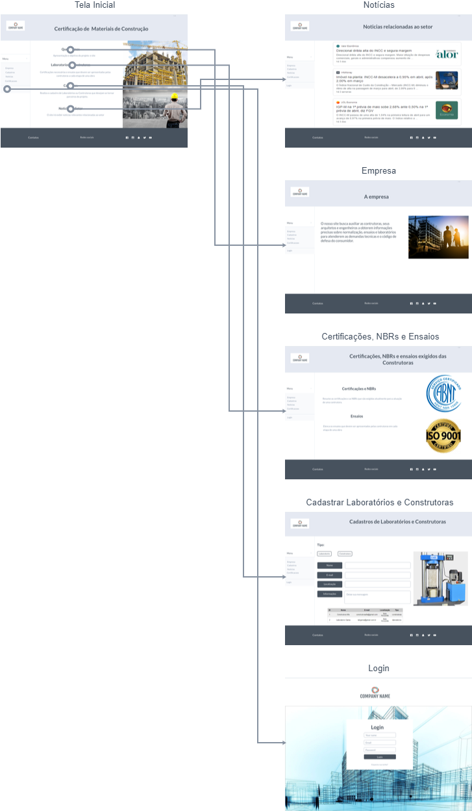
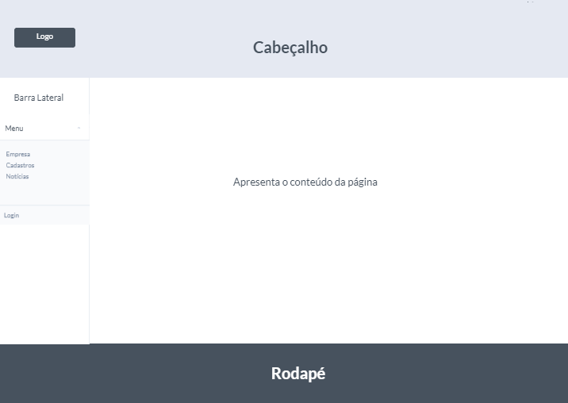
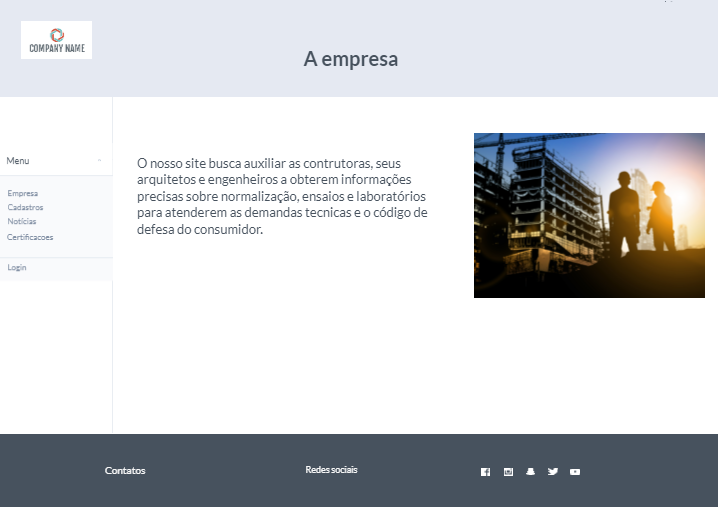
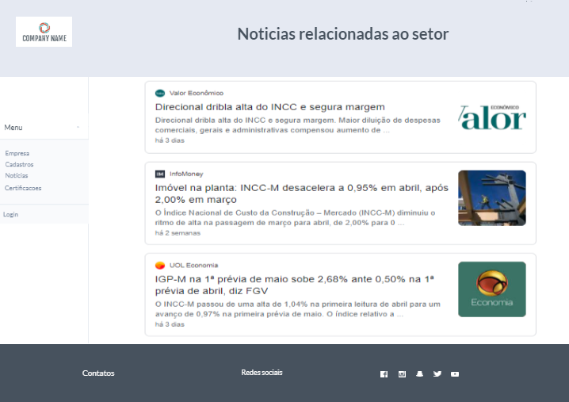
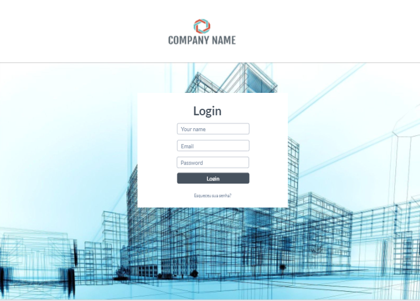
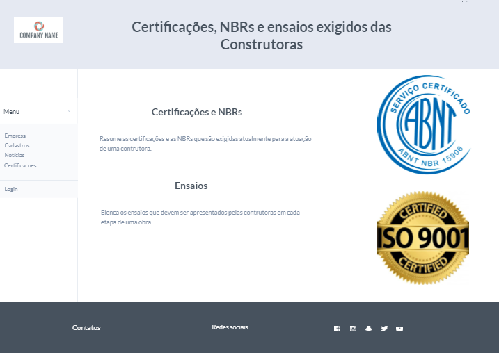
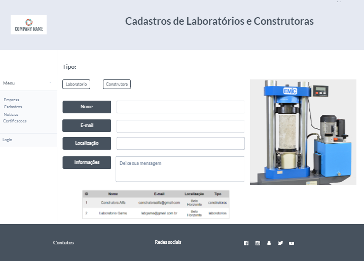

#
# 4. Projeto de Interface

Dentre as preocupações para a montagem da interface do sistema, estamos estabelecendo foco em questões como agilidade, acessibilidade e usabilidade. Desta forma, o projeto tem uma identidade visual padronizada em todas as telas que são projetadas para funcionamento em desktops e dispositivos móveis.

## Diagrama de Fluxo

## Fluxo do Usuário

O diagrama apresentado na Figura 4 mostra o fluxo de interação do usuário pelas telas do sistema. Cada uma das telas deste fluxo é detalhada na seção de Wireframes que se segue. Para visualizar o wireframe interativo, acesse o ambiente MarvelApp do projeto: [https://userflows.marvelapp.com/gc47b5e].

Figura 4 - Fluxo de telas do usuário

## Wireframes

Conforme fluxo de telas do projeto, apresentado no item anterior, as telas do sistema são apresentadas em detalhes nos itens que se seguem. As telas do sistema apresentam uma estrutura comum que é apresentada na Figura 5. Nesta estrutura, existem 3 grandes blocos, descritos a seguir. São eles:

- **Cabeçalho -** local onde são dispostos elementos fixos de identidade (logo) e o título da página;
- **Conteúdo -** apresenta o conteúdo da tela em questão;
- **Barra lateral** - apresenta os elementos de navegação do site;
- **Rodapé** - apresenta os contatos e redes sociais dos mantedores do site.

Figura 5 - Estrutura padrão do site

### Tela - Home-Page

A tela de home-page realiza a apresentação do site. Na categoria &quot;Quem somos&quot; é possível obter maiores informações sobre o projeto e seus envolvidos. O menu lateral contém ícones de acesso em que o usuário consegue se mover e localizar o conteúdo desejado de forma mais rápida. O bloco de Conteúdo destaca quatro elementos principais presentes no site:

- Componente de **pesquisa** que permite localizar Laboratórios parceiros em determinada cidade;
- Componente de **notícias** que leva o usuário para a tela de Notícias relacionadas ao setor da Construção Civil;
- Componente de **cadastro** que permite realizar o cadastro de Laboratórios e Construtoras que pretendam se tornar parceiros;
- Relação de **certificações, NBRs** e de **ensaios** que são exigidos atualmente das construtoras;

Figura 6 - Tela Inicial 

### Tela – Empresa  

Apresenta os objetivos do projeto/Quem somos. 

Figura 7 - Tela Inicial 

### Tela - Notícias do Setor

A tela de notícias de categoria apresenta, no Bloco de Conteúdo, notícias referentes à categoria de construção civil e de atualizações relacionadas ao setor. O Bloco de Barra Lateral apresenta os mesmos elementos da Home-Page.

Figura 8 - Tela da Notícias do Setor 

### Tela – Login 

Tela para login dos administradores do site. 

Figura 9 - Tela de Resultados de Pesquisa 

### Tela – Certificações, NBRs e Ensaios

A tela fornece uma relação das Certificações, NBRs e os Ensaios que uma construtora deve apresentar em cada etapa de uma obra. O Bloco de Barra Lateral apresenta os mesmos elementos da Home-Page.

Figura 10 - Tela Certificações, NBRs e os Ensaios 

### Tela - Cadastros

A tela de Cadastro permite cadastrar os Laboratórios e Construtoras que tenham interesse em se tornar parceiras do projeto. O Bloco de Barra Lateral apresenta os mesmos elementos da Home-Page.

Figura 11 - Tela de cadastro 

