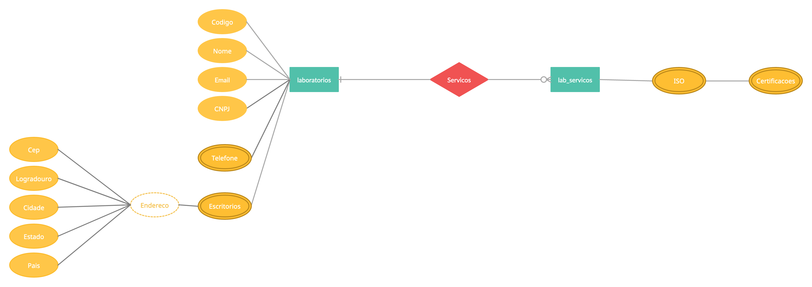

# 5. Arquitetura da Solução

Nesta seção são apresentados os detalhes técnicos da solução criada pela equipe, tratando dos componentes que fazem parte da solução e do ambiente de hospedagem da solução.

### Diagrama de classes 

Figura 12 - Diagrama de classe

### Modelo ER e Esquema Relacional

Figura 12 - Modelo ER

### Diagrama de Componentes

Os componentes que fazem parte da solução são apresentados na Figura que se segue.

Figura 12 - Arquitetura da Solução

A solução implementada conta com os seguintes módulos:

- **Navegador** - Interface básica do sistema
  - **Páginas Web** - Conjunto de arquivos HTML, CSS, JavaScript e imagens que constituem a interface da aplicação hospedada na Web.
  - **Local Storage** - armazenamento mantido no Navegador, onde são implementados bancos de dados baseados em JSON. São eles:
    - **Canais** - seções de notícias apresentadas
    - **Comentários** - registro de opiniões dos usuários sobre as notícias
    - **Preferidas** - lista de notícias mantidas para leitura e acesso posterior
- **Bing News API** - plataforma que permite o acesso às notícias exibidas no site.
- **Heroku** - local na Internet onde as páginas são mantidas e acessadas pelo navegador.

### Hospedagem

O site utiliza a plataforma do Git Pages como ambiente de hospedagem do site do projeto. O site é mantido no ambiente da URL:

https://pages.github.com/

A publicação do site no  Git Pages é feita por meio de uma submissão do projeto (push) via git para o repositório remoto que se encontra no endereço:

https://github.com/ICEI-PUC-Minas-PMV-ADS/pmv-ads-2021-1-e1-proj-web-t5-time-01-certificacoes-de-materiais/tree/main/src 
