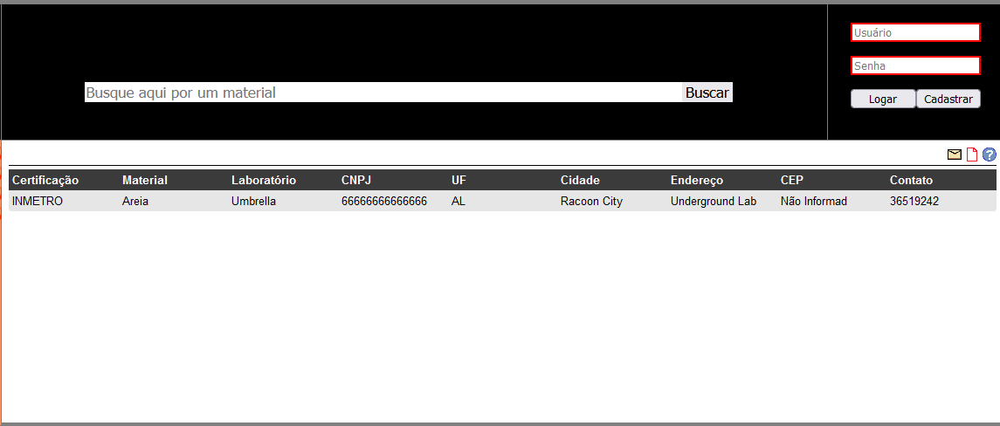
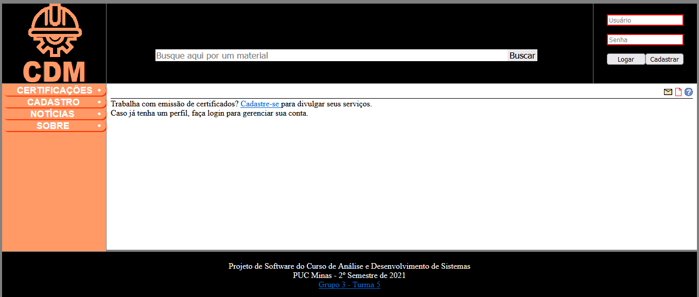
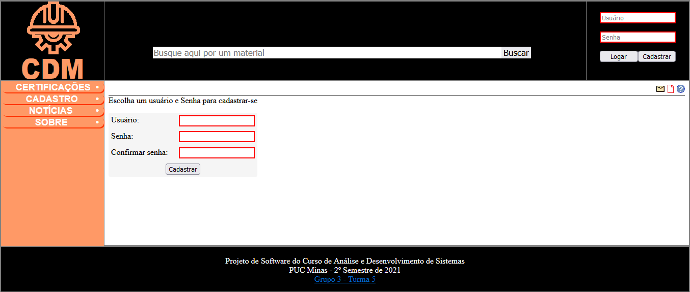
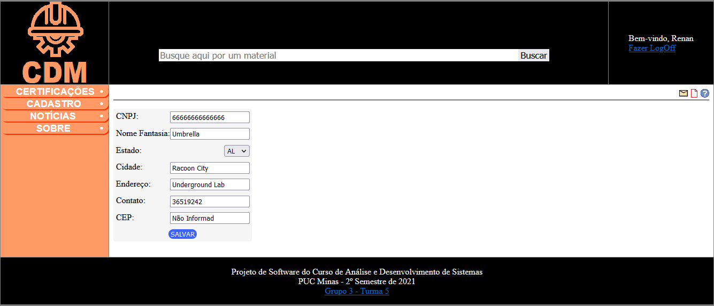
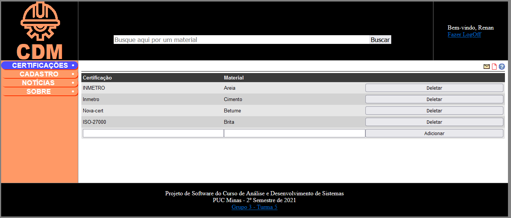

# 7. Funcionalidades do Sistema (Telas)

Nesta seção são apresentadas as telas desenvolvidas para cada uma das funcionalidades do sistema. O respectivo endereço (URL) e outras orientações de acesso são apresentadas na sequência.

## Tela de Consulta

Página que permite buscar por entidades certificadoras de material.



Disponível em:
[https://github.com/ICEI-PUC-Minas-PMV-ADS/pmv-ads-2021-2-e2-proj-int-t5-certificacao-de-materiais/blob/main/src/consulta.php](https://github.com/ICEI-PUC-Minas-PMV-ADS/pmv-ads-2021-2-e2-proj-int-t5-certificacao-de-materiais/blob/main/src/consulta.php)

### **Requisitos atendidos**

* RF-01

### **Artefatos da funcionalidade**

* index.php
* index.css
* consulta.php
* subpages.css
* help.png
* pdf.png
* consulta.sql
* mail.png
* index.js
* subpages.js
* jquery-3.6.0.min.js

### **Estrutura de Dados**

Abaixo, estrutura do banco utilizado por esta funcionalidade.

```sql
-- Consulta por certificacão através do nome do Material.

SELECT
Certificacao.nome AS cer_nome,
Material.nome AS mat_nome,
Laboratorio.cnpj AS lab_cnpj,
Laboratorio.nome AS lab_nome,
Laboratorio.uf AS lab_uf,
Laboratorio.cidade AS lab_cidade,
Laboratorio.endereco AS lab_end,
Laboratorio.cep AS lab_cep,
Laboratorio.telefone AS lab_tel
FROM Certificacao
JOIN Laboratorio ON Laboratorio.id = Certificacao.laboratorio_id
JOIN Material ON Material.id = Certificacao.material_id
WHERE Material.nome = ?;

```


### **Instruções de acesso**

1. Abra um navegador de Internet e informe a URL do projeto (ainda não publicado).
2. A funcionalidade de consulta é acessada pelo índice do site.

## Cadastro

Permitir o cadastro de contas e Laboratórios.


,


Disponível em:
[https://github.com/ICEI-PUC-Minas-PMV-ADS/pmv-ads-2021-2-e2-proj-int-t5-certificacao-de-materiais/blob/main/src/join.php](https://github.com/ICEI-PUC-Minas-PMV-ADS/pmv-ads-2021-2-e2-proj-int-t5-certificacao-de-materiais/blob/main/src/join.php)

[https://github.com/ICEI-PUC-Minas-PMV-ADS/pmv-ads-2021-2-e2-proj-int-t5-certificacao-de-materiais/blob/main/src/labs.php](https://github.com/ICEI-PUC-Minas-PMV-ADS/pmv-ads-2021-2-e2-proj-int-t5-certificacao-de-materiais/blob/main/src/labs.php)

### **Requisitos atendidos**

* RF-03, RF-06

### **Artefatos da funcionalidade**

* index.php
* index.css
* labs.php
* join.php
* subpages.css
* help.png
* mail.png
* pdf.png
* cria.sql
* index.js
* subpages.js
* jquery-3.6.0.min.js

### **Estrutura de Dados**

Abaixo, estrutura do banco utilizado por esta funcionalidade.

```sql
-- Começa do zero

DROP DATABASE IF EXISTS CDM;
CREATE DATABASE CDM;

-- Usuários e permissionamento.

CREATE USER IF NOT EXISTS 'public_user'@'localhost' IDENTIFIED BY 'EEFKrc!!51NdI';
GRANT SELECT, INSERT ON CDM.* TO 'public_user'@'localhost';
GRANT UPDATE ON CDM.Laboratorio TO 'public_user'@'localhost';
GRANT DELETE ON CDM.Certificacao TO 'public_user'@'localhost';

-- Cria estrutura do banco

USE CDM;

CREATE TABLE Usuario (
	username VARCHAR(20),
	password VARCHAR(20) NOT NULL,

    PRIMARY KEY(username)
);

CREATE TABLE Laboratorio (
    id INT(6) AUTO_INCREMENT,
    usuario_username VARCHAR(20),
    nome VARCHAR(30) NOT NULL,
    cnpj VARCHAR(14) NOT NULL,
    uf VARCHAR(2),
    cidade VARCHAR(30),
    endereco VARCHAR(100),
    cep VARCHAR(13),
    telefone VARCHAR(100),

    PRIMARY KEY (id),
    FOREIGN KEY (usuario_username) REFERENCES Usuario(username)
);

CREATE TABLE Material (
    id INT(6) AUTO_INCREMENT,
    nome VARCHAR(30) NOT NULL, 
    
    PRIMARY KEY(id)
);

-- Junction laboratorio/material

CREATE TABLE Certificacao (
    laboratorio_id INT(6),
    material_id INT(6),
    nome VARCHAR(30),

    CONSTRAINT fk_laboratorio FOREIGN KEY (laboratorio_id) REFERENCES Laboratorio (id),
    CONSTRAINT fk_material FOREIGN KEY (material_id) REFERENCES Material (id),

    CONSTRAINT pk_certificacao PRIMARY KEY (laboratorio_id, material_id)
);

```


### **Instruções de acesso**

1. Abra um navegador de Internet e informe a URL do projeto (ainda não publicado).
2. A funcionalidade de cadastro de usuário pode ser acessada acessada pelo cabeçalho no índice do site. A funcionalidade de cadastro de laboratório pode ser acessada via menu lateral "CADASTRO".

## Gestão de portifólio de certificações

Permitir a empresas cadastradas gerir as certificações que emite.



Disponível em:
[https://github.com/ICEI-PUC-Minas-PMV-ADS/pmv-ads-2021-2-e2-proj-int-t5-certificacao-de-materiais/blob/main/src/certs.php](https://github.com/ICEI-PUC-Minas-PMV-ADS/pmv-ads-2021-2-e2-proj-int-t5-certificacao-de-materiais/blob/main/src/certs.php)

### **Requisitos atendidos**

* RF-08

### **Artefatos da funcionalidade**

* index.php
* index.css
* certs.php
* subpages.css
* help.png
* mail.png
* pdf.png
* cria.sql
* index.js
* subpages.js
* jquery-3.6.0.min.js

### **Estrutura de Dados**

Abaixo, estrutura do banco utilizado por esta funcionalidade.

```sql
-- Começa do zero

DROP DATABASE IF EXISTS CDM;
CREATE DATABASE CDM;

-- Usuários e permissionamento.

CREATE USER IF NOT EXISTS 'public_user'@'localhost' IDENTIFIED BY 'EEFKrc!!51NdI';
GRANT SELECT, INSERT ON CDM.* TO 'public_user'@'localhost';
GRANT UPDATE ON CDM.Laboratorio TO 'public_user'@'localhost';
GRANT DELETE ON CDM.Certificacao TO 'public_user'@'localhost';

-- Cria estrutura do banco

USE CDM;

CREATE TABLE Usuario (
	username VARCHAR(20),
	password VARCHAR(20) NOT NULL,

    PRIMARY KEY(username)
);

CREATE TABLE Laboratorio (
    id INT(6) AUTO_INCREMENT,
    usuario_username VARCHAR(20),
    nome VARCHAR(30) NOT NULL,
    cnpj VARCHAR(14) NOT NULL,
    uf VARCHAR(2),
    cidade VARCHAR(30),
    endereco VARCHAR(100),
    cep VARCHAR(13),
    telefone VARCHAR(100),

    PRIMARY KEY (id),
    FOREIGN KEY (usuario_username) REFERENCES Usuario(username)
);

CREATE TABLE Material (
    id INT(6) AUTO_INCREMENT,
    nome VARCHAR(30) NOT NULL, 
    
    PRIMARY KEY(id)
);

-- Junction laboratorio/material

CREATE TABLE Certificacao (
    laboratorio_id INT(6),
    material_id INT(6),
    nome VARCHAR(30),

    CONSTRAINT fk_laboratorio FOREIGN KEY (laboratorio_id) REFERENCES Laboratorio (id),
    CONSTRAINT fk_material FOREIGN KEY (material_id) REFERENCES Material (id),

    CONSTRAINT pk_certificacao PRIMARY KEY (laboratorio_id, material_id)
);

```


### **Instruções de acesso**

1. Abra um navegador de Internet e informe a URL do projeto (ainda não publicado).
2. A funcionalidade de cadastro de usuário pode ser acessada acessada pelo cabeçalho no índice do site. A funcionalidade de cadastro de laboratório pode ser acessada via menu lateral "CADASTRO".