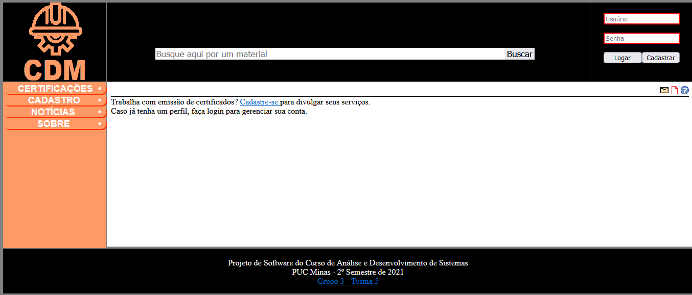
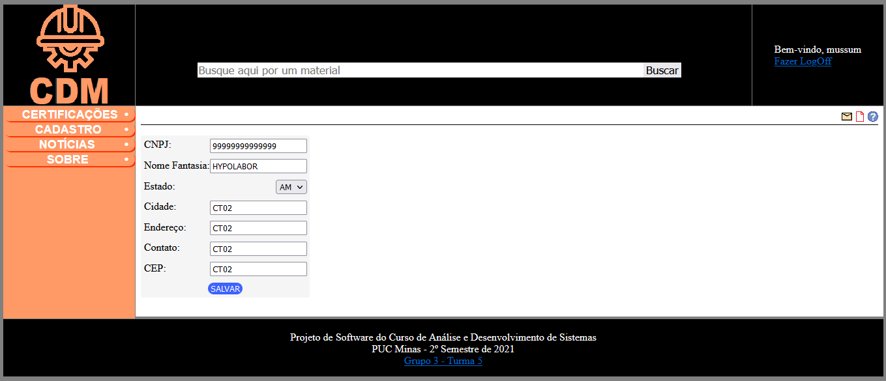
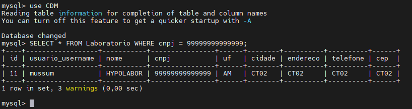
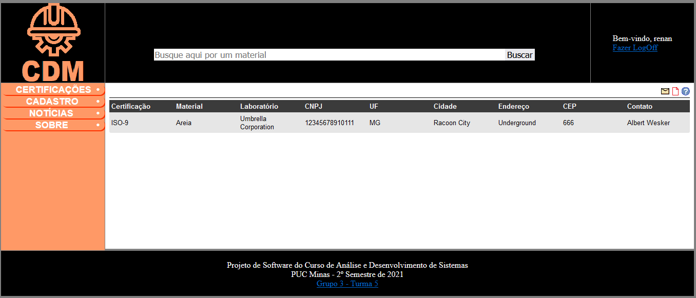

# 9. Registro de Testes de Software

## CT-01: Logar na Plataforma

* **Objetivo:** Verificar se a rotina de login está funcionando corretamente
* **Etapas**: 
 1. Acessar página de Consulta: <url>/index.php
 2. Informar um usuário e senha válidos.
 3. Apertar ENTER ou clicar no botão "Logar". 
* **Saída Esperada**: Boas vindas no cabeçalho, acesso às sessões Certificação e Cadastro.

### Evidências

Interface de acesso:

Login com sucesso:

## CT-02: Realizar cadastro de Laboratório

* **Objetivo:** Validar que é possível cadastrar informações de contato no sistema.
* **Etapas**: 
 1. Um vez logado, acessar página de Cadastro: <url>/labs.php
 2. Preencher informações necessárias para cadastro.
 3. Apertar ENTER ou clicar no botão "SALVAR". 
* **Saída Esperada**: Nova entrada de laboratório no banco.

### Evidências

Interface de cadastro:

Interface preenchida:

Inserção bem-sucedida no banco:

## CT-03: Localizar Entidade Certificadora

* **Objetivo:** Encontrar o endereço de uma entidade certificadora dado um material.
* **Etapas**: 
 1. Acessar página principal: <url>/index.php
 2. Informar um material válido.
 3. Apertar ENTER ou clicar no botão "Procurar". 
* **Saída Esperada**: Nome e endereço de(as) entidade(as) que certifica(m) o material.

### Evidências

Encontrado informações de laboratório que emite certificação para areia:

