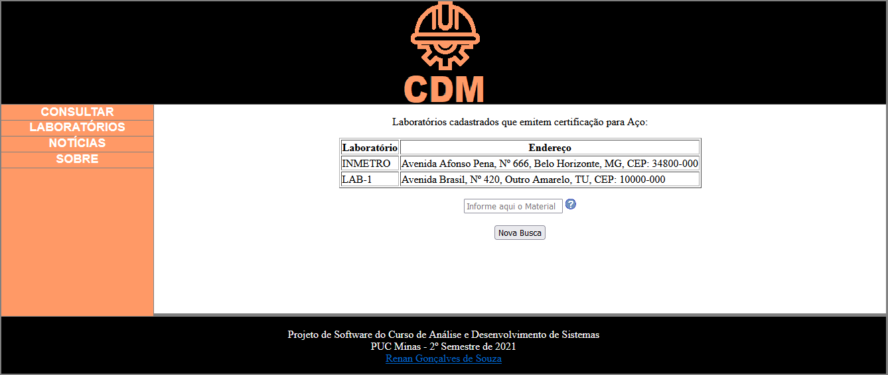

# 9. Registro de Testes de Software

## CT-03: Localizar Entidade Certificadora

* **Objetivo:** Encontrar o endereço de uma entidade certificadora dado um material.
* **Etapas**: 
 1. Acessar página de Consulta: <url>/consulta.html
 2. Informar um material válido.
 3. Apertar ENTER ou clicar no botão "Procurar". 
* **Saída Esperada**: Nome e endereço de(as) entidade(as) que certifica(m) o material.

### Evidências

Etapa 1

Etapa 2

Etapa 3

