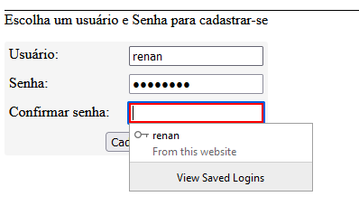
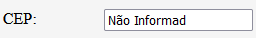
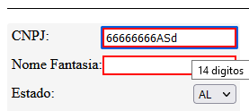

# Registro de Testes de Usabilidade

## TU-01

* **Objetivo:** Mensurar o esforço e qualidade da experiência para realizar um cadastro no sistema. Certificar que as interações necessárias para realização do cadastro sejam acessíveis, rápidas e sem ambiguidade.

* **Organização:** Foi feita a inserção de cadastros novos no sistema. Tentativas de usuários repetidos e entradas já existentes no banco. Tentativas de injetar código malicioso pelo front-end. Tentativa de excer o limite dos campos. Tentativa de entrar com dados imprórpios aos campos.

### Resultados

Sistema se comportou como esperado. A velocidade de cadastro é limitada somente a velocidade que o usuário consegue preencher os campos.

Os filtro estão funcionando. Formulários não são enviados sem informação obrigatória. 


Campos não informados são tratados internamente com valores padrão.


Campos dão feedback visual ao usuário quando preenchidos com caracteres impróprios. Também é apresentado o que se espera via pop-up.


### Conclusões
Sistema é fácil, usuário é encaminhado automaticamente às sessões mais prováveis que deseja. Por exemplo, automaticamente logado e direcionado à página de cadastro no prmeiro acesso. Em acessos posteriores, automaticamente direcionado à página de gestão de certificações. Sistema também prevê e evita erros comuns, dando a todo momento retorno visual ao usuário do que está acontecendo e o porquê. 

## TU-02

* **Objetivo:** Mensurar o esforço e qualidade da experiência para encontrar um laboratório que emita certificações para um determinado material. Certificar que as interações necessárias para encontrar a informação desejada sejam acessíveis, rápidas e sem ambiguidade. Certificar que a informação encontrada é completa e satisfatória.
* **Organização:** O Teste foi reproduzido via acesso remoto com dois voluntários separadamente. Foi apresentado a cada a interface do sistema sem mais explicações de seus componentes. Foi compartilhada uma cópia e solicitado o preenchimento do seguinte formulário digital: [template_questionário_TU-02](forms/template_questionário_TU-02.pdf)  

Para os testes, o banco da aplicação foi preenchido com as seguintes informações:

```sql
USE CertMat;

INSERT INTO Laboratorio (Nome, Contato) VALUES ("INMETRO", "Avenida Afonso Pena, Nº 666, Belo Horizonte, MG, CEP: 34800-000");
INSERT INTO Laboratorio (Nome, Contato) VALUES ("LAB-1", "Avenida Brasil, Nº 420, Outro Amarelo, TU, CEP: 10000-000");

INSERT INTO Material (Nome) VALUES ("Aço");
INSERT INTO Material (Nome) VALUES ("Areia");
INSERT INTO Material (Nome) VALUES ("Cimento");
INSERT INTO Material (Nome) VALUES ("Betume");

INSERT INTO Certificacao (Laboratorio_Nome, Material_Nome) VALUES ("INMETRO", "Aço");
INSERT INTO Certificacao (Laboratorio_Nome, Material_Nome) VALUES ("INMETRO", "Areia");
INSERT INTO Certificacao (Laboratorio_Nome, Material_Nome) VALUES ("INMETRO", "Cimento");

INSERT INTO Certificacao (Laboratorio_Nome, Material_Nome) VALUES ("LAB-1", "Aço");
INSERT INTO Certificacao (Laboratorio_Nome, Material_Nome) VALUES ("LAB-1", "Betume");
```

### Resultados

* Os formulário preenchidos são acessados em:
 [Participante 1](forms/Rodolfo_questionário_TU-02.pdf)
 [Participante 2](forms/Guilherme_questionário_TU-02.pdf)

* Todos os participantes encontraram as informações solicitadas.
* Nenhum levou mais de 1 minuto em cada questão.
* Não foi relatada nenhuma dificuldade em cumprir a tarefa.
* Não foi solicitado apoio ou feito questionamento adicional durante o teste.
* Apesar da aplicação contar com sessão de ajuda, nenhum dos participantes fez uso desta.

### Conclusões

Apesar dos resultados positivos, os teste foram feitos com apenas dois usuário, nenhum deles da demografia desejada e ambos com intimidade alta com aplicações WEB.
Necessário uma amostra maior e mais diversa de participantes.

